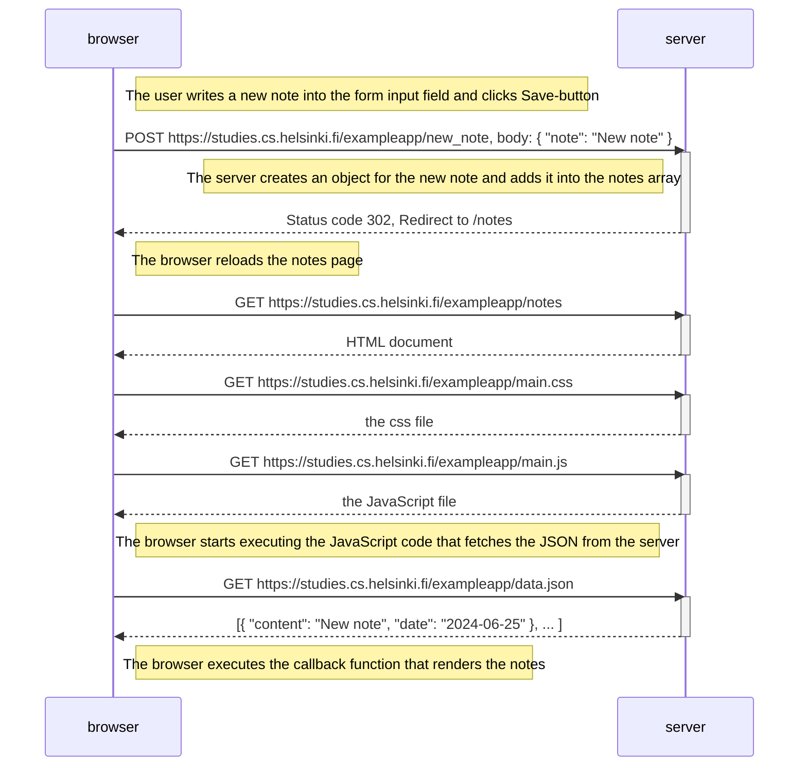

```mermaid
sequenceDiagram
    participant browser
    participant server
    
    Note right of browser: The user writes a new note into the form input field and clicks Save-button

    browser->>server: POST https://studies.cs.helsinki.fi/exampleapp/new_note, body: { "note": "New note" }
    activate server
    
    Note left of server: The server creates an object for the new note and adds it into the notes array

    server-->>browser: Status code 302, Redirect to /notes
    deactivate server

    Note right of browser: The browser reloads the notes page

    browser->>server: GET https://studies.cs.helsinki.fi/exampleapp/notes
    activate server
    server-->>browser: HTML document
    deactivate server
    
    browser->>server: GET https://studies.cs.helsinki.fi/exampleapp/main.css
    activate server
    server-->>browser: the css file
    deactivate server
    
    browser->>server: GET https://studies.cs.helsinki.fi/exampleapp/main.js
    activate server
    server-->>browser: the JavaScript file
    deactivate server
    
    Note right of browser: The browser starts executing the JavaScript code that fetches the JSON from the server
    
    browser->>server: GET https://studies.cs.helsinki.fi/exampleapp/data.json
    activate server
    server-->>browser: [{ "content": "New note", "date": "2024-06-25" }, ... ]
    deactivate server    

    Note right of browser: The browser executes the callback function that renders the notes
```