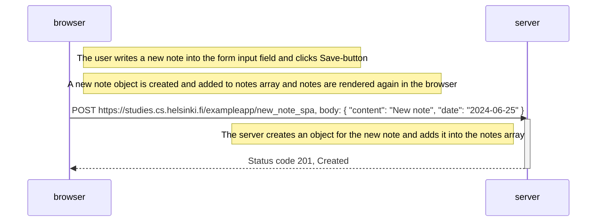

```mermaid
sequenceDiagram
    participant browser
    participant server
    
    Note right of browser: The user writes a new note into the form input field and clicks Save-button

    Note right of browser: A new note object is created and added to notes array and notes are rendered again in the browser

    browser->>server: POST https://studies.cs.helsinki.fi/exampleapp/new_note_spa, body: { "content": "New note", "date": "2024-06-25" }
    activate server

    Note left of server: The server creates an object for the new note and adds it into the notes array

    server-->>browser: Status code 201, Created
    deactivate server

```